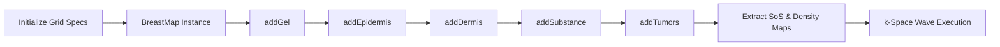

# Acoustic and Tissue Simulation for Breast Tumor Detection using k-Wave

This repository contains a full computational simulation pipeline designed to model multi-layered biological tissues (specifically human breast anatomy) and perform ultrasonic full-waveform modeling. By computing customized continuous distribution models of standard tissue property bounds, it models sound propagation through heterogeneous structures and lesions.

The pipeline simulates a physical coupling layer, an epidermis layer, a dermis layer, general background fat/subcutaneous tissue matrices, and populates randomly shaped and oriented physiological tumors based on recent deep learning ultrasound reconstruction literature.

---

## 📖 Table of Contents
* [Features](#-features)
* [Mathematical & Tissue Model Specifications](#-mathematical--tissue-model-specifications)
* [Simulation Workflow](#-simulation-workflow)
* [Dependencies & Requirements](#-dependencies--requirements)
* [Usage Guide](#-usage-guide)
* [Visualizing Outputs](#-visualizing-outputs)
* [References](#-references)

---

## ✨ Features

- **Automated Physical-to-Pixel Mapping:** Converts physical layer thicknesses directly from micrometers ($\mu\text{m}$) into custom spatial computational grids matching standard acoustic parameters.
- **Stochastic Heterogeneity Optimization:** Applies normal Gaussian noise distribution models to the standard dynamic limits of tissue parameters to represent real biological porosity and acoustic backscattering texture.
- **Multi-Layer Synthetic Tissue Generation (`BreastMap`):** Pipeline mimics natural medical constraints sequentially:
  1. **Coupling Gel Layer:** Simulates Propylene Glycol layer dynamics.
  2. **Epidermis Layer:** Models thin skin layer bounds based on dermatological clinical benchmarks.
  3. **Dermis Layer:** Simulates dense core skin variations.
  4. **Substance Tissue:** Fills remaining space dynamically with fat/muscle backgrounds.
  5. **Tumor Pathology Injection:** Randomly populates varying quantities of elliptical lesions mimicking solid malignant structures or fluid-filled cysts.
- **Advanced Acoustic Field Modeling:** Built on top of the first-order **k-space** pseudo-spectral numerical method via the `kspaceFirstOrder2D` execution engine.

---

## 🔬 Mathematical & Tissue Model Specifications

The tissue structures generated across the spatial computational grid assign randomized bounds compiled from medical imaging literature:

| Tissue Layer / Component | Physical Thickness Layer Range | Speed of Sound (SoS) Range ($c_0$) | Mass Density Range ($\rho_0$) |
| :--- | :--- | :--- | :--- |
| **Propylene Glycol Gel** | $1 \text{ pixel}$ | $1467.8 \rightarrow 1541.1 \text{ m/s}$ | $1036 \rightarrow 1040 \text{ kg/m}^3$ |
| **Epidermis** | $84.5 \rightarrow 156.7 \ \mu\text{m}$ | $1531.9 \rightarrow 1735.5 \text{ m/s}$ | $1095.1 \rightarrow 1122.9 \text{ kg/m}^3$ |
| **Dermis** | $1005.6 \rightarrow 1670.2 \ \mu\text{m}$ | $1568.9 \rightarrow 1680.5 \text{ m/s}$ | $1095.1 \rightarrow 1122.8 \text{ kg/m}^3$ |
| **Subcutaneous Background** | Dynamic Rest | $1450.0 \rightarrow 1540.0 \text{ m/s}$ | $950.0 \rightarrow 1020.0 \text{ kg/m}^3$ |
| **Lesion (Solid Malignant)** | Elliptical Form | $1550.0 \rightarrow 1700.0 \text{ m/s}$ | $1040.0 \rightarrow 1100.0 \text{ kg/m}^3$ |
| **Lesion (Cyst/Fatty Mass)** | Elliptical Form | $1300.0 \rightarrow 1450.0 \text{ m/s}$ | $900.0 \rightarrow 940.0 \text{ kg/m}^3$ |

### Elliptical Lesion Geometry
The spatial boundary transformations for modeling tumor structures utilize an oriented quadratic matrix condition:

$$\frac{X_{\text{rot}}^2}{r_x^2} + \frac{Y_{\text{rot}}^2}{r_y^2} \le 1$$

Where spatial positions undergo translation and coordinate matrix rotation via an incident angle ($\theta$):

$$X_{\text{rot}} = (X - c_x)\cos(\theta) + (Y - c_y)\sin(\theta)$$

$$Y_{\text{rot}} = -(X - c_x)\sin(\theta) + (Y - c_y)\cos(\theta)$$

---

## ⚙️ Simulation Workflow

The script uses a clear modular method-chaining structure to create datasets step-by-step:

1. Griffiths, C. E. M., Barker, J., Bleiker, T. O., Hussain, W., & Simpson, R. C. (Eds.).(2024). Rook’s Textbook of Dermatology (10th ed.). Wiley-Blackwell. ISBN: 978-1-119-70928-2.
2. Moran, C. M., Bush, N. L., & Bamber, J. C. (1995). ULTRASONIC PROPAGATION PROPERTIES OF EXCISED HUMAN SKIN. Ultrasound in Med. & Biol., 21(9), 1177-1190.
3. Oltulu, P., et al. (2018). Measurement of Epidermis, Dermis, and Total Skin Thicknesses from Six Different Body Regions with a new Ethical Histometric Technique. Turk J Plast Surg.
4. Hwang et al. (2002). Skin thickness of Korean adults. Surgical and Radiologic Anatomy, 24, 183–189.
5. IT’IS (Foundation for Research on Information Technologies in Society) Database, V5.
6. Thol, M., et al. (2021). Speed-of-Sound Measurements and a Fundamental Equation of State for Propylene Glycol. J. Phys. Chem. Ref. Data, 50, 023105.
7. REMPEC MIDSIS. Propylene Glycol Chemical Data. Available at: https://midsis.rempec.org/en/find-chemical/propylene-glycol
8. B. E. Treeby and B. T. Cox, "k-Wave: MATLAB toolbox for the simulation and reconstruction of photoacoustic wave-fields," J. Biomed. Opt., vol. 15, no. 2, p. 021314, 2010.
9. B. E. Treeby, J. Jaros, A. P. Rendell, and B. T. Cox, "Modeling nonlinear ultrasound propagation in heterogeneous media with power law absorption using a k-space pseudospectral method," J. Acoust. Soc. Am., vol. 131, no. 6, pp. 4324-4336, 2012.
10. B. E. Treeby, J. Jaros, D. Rohrbach, and B. T. Cox, "Modelling elastic wave propagation using the k-Wave MATLAB toolbox," IEEE International Ultrasonics Symposium, pp. 146-149, 2014.
11. B. E. Treeby, J. Budisky, E. S. Wise, J. Jaros, and B. T. Cox, "Rapid calculation of acoustic fields from arbitrary continuous-wave sources," J. Acoust. Soc. Am., vol. 143, no. 1, pp. 529-537, 2018.

